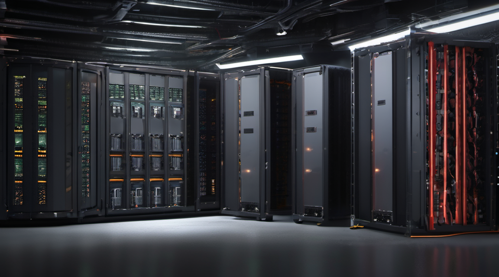

# Libcage

<!-- BEGIN: REPO HERO -->

<!-- END: REPO HERO -->

**A zero-dependency pure-C LLM agent runtime for autonomous code repair.**

Every coding agent today is Python or Node. Libcage runs where those can't —
air-gapped CI, embedded boxes, minimal containers, bare metal with no venv.
A single static binary, libc + POSIX sockets only. ~21KB, zero dependencies.

## Install

```sh
curl -fsSL https://raw.githubusercontent.com/Hardonian/libcage/main/install.sh | sh
```

Builds from source or pulls the latest release binary for `linux-amd64` /
`macos-amd64` into `~/.local/bin`.

## What it does

1. Reads a prompt + a target source file.
2. Sends them to an OpenAI-compatible `/chat/completions` endpoint.
3. Parses the model's corrected file (or unified diff) from the reply.
4. Writes it, compiles, and runs your test command.
5. On failure, feeds the error back to the model and loops (max N times).

## Build

```sh
make            # cc -O2 -std=c11 -o libcage agent.c  (no -l flags)
make test       # self-repair self-test (asserts the agent produces a working binary)
```

`make test` is the CI gate: it repairs a deliberately broken C file via local
Ollama (if present) and fails the build if the result does not compile + run.

## Usage

```sh
export LIBCAGE_API_BASE=http://localhost:11434/v1   # Ollama (default)
export LIBCAGE_MODEL=qwen2.5-coder:7b
libcage "Fix the off-by-one in parse()" broken.c \
       "cc -o out broken.c" "./out"
```

### Environment

| Var | Default | Purpose |
|-----|---------|---------|
| `LIBCAGE_API_BASE` | `http://localhost:11434/v1` | OpenAI-compatible base URL |
| `LIBCAGE_API_KEY`  | `ollama` | Sent as `Authorization: Bearer` |
| `LIBCAGE_MODEL`    | `qwen2.5-coder:7b` | Model name |
| `LIBCAGE_MAX_ITER` | `5` | Repair-loop iterations |

Works against OpenAI, Ollama, or any `/v1/chat/completions` endpoint — including
a self-hosted inference lane on an EPYC GPU box.

## Demo

Recorded self-repair session (libcage fixes a broken file via local Ollama, then
it compiles + runs):

- Cast file: [`demo.cast`](demo.cast) — play with `asciinema play demo.cast`
- Watch online: paste `demo.cast` into https://asciinema.org/ or self-host the player.

Quick text recap:

```
$ printf '#include <stdio.h>\nint main(){ printf("hello\n"; return 0; }\n' > broken.c
$ libcage "Fix the syntax error so this compiles and prints hello" broken.c \
    "cc -o broken_out broken.c" "./broken_out"
libcage: iteration 1/5
libcage: compiling...
libcage: testing...
hello
libcage: SUCCESS after 1 iteration(s)
```

## Tiers

| Tier | Price | Features |
|------|-------|----------|
| **Libcage** | $29 (one-time) | Autonomous repair loop. No license needed. |
| **Libcage Pro** | $99 (one-time) | `+ --sbom` (CycloneDX SBOM) + `--policy` (endpoint allowlist). License-gated. |
| **Libcage Team** | $299 (5-seat pack) | Pro + `--team N` (seats) + `--audit-log` (HMAC-chained tamper-evident log). License-gated. |

Pro/Team features unlock with `--pro <license_file>` (any non-empty license key
delivered after purchase).

### Pro example

```sh
libcage --pro license.key --sbom agent.c
libcage --pro license.key --policy policy.json "fix the parser" broken.c "cc -o out broken.c"
```

### Team example

```sh
libcage --pro team.key --team 5 --audit-log /var/log/libcage.audit \
  --policy policy.json "fix the parser" broken.c "cc -o out broken.c"
# /var/log/libcage.audit:
# 0f0da2ad... {"t":"...","e":{"action":"session_start","seats":5}}
# 9b1c...    {"t":"...","e":{"action":"repair_success","target":"broken.c","iter":1,"seats":5}}
```

## Why pure C

- **No supply chain.** One file, auditable by eye. No npm/pip transitive CVEs.
- **Portable.** `cc -O2 -std=c11` on Linux, macOS, BSD, minimal containers.
- **Future-proof.** C outlives language trends.

## Release process

Tag a version to ship:

```sh
git tag v0.1.0 && git push --tags
```

GitHub Actions builds `linux-amd64` + `macos-amd64` static binaries and
publishes a GitHub Release automatically. See `.github/workflows/release.yml`.

## License

Free tier: autonomous repair (source provided for audit/modification).
Pro/Team: commercial license delivered on purchase. See product terms at
[aiautomatedsystems.ca/p/libcage](https://aiautomatedsystems.ca/p/libcage).
